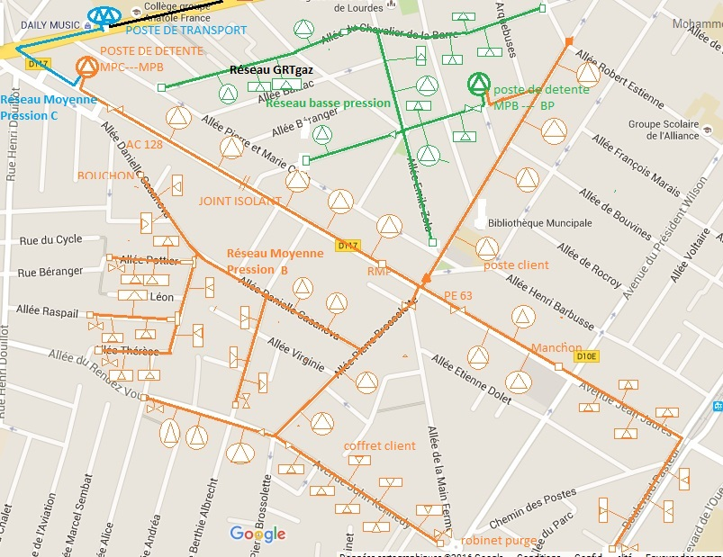

% Projet de Structuration
% Modélisation du réseau de Distrubition de gaz de Grdf
% Amiri Mohammed, Milville Romain et Pensier Philémon
% soutenance le 14/01/2016 

## Plan
- 1- Introduction
- 2- Présentation
- 3- Intéraction avec le client
- 4- l'aspect securité
- 5- Conclusion

## 1- Introduction

Ce projet rentre dans le cadre des projet 

## 2- Présentation

- Éteindre l'alarme
- Sortir du lit

## 3- Intéraction avec le client

À faire dans l'ordre suivant : 

- Servir le café
- Découper une part de brioche
- Manger la brioche
- Boire le café

## 4- l'aspect securité

## 5- Conclusion

##    Merci Pour votre attention
