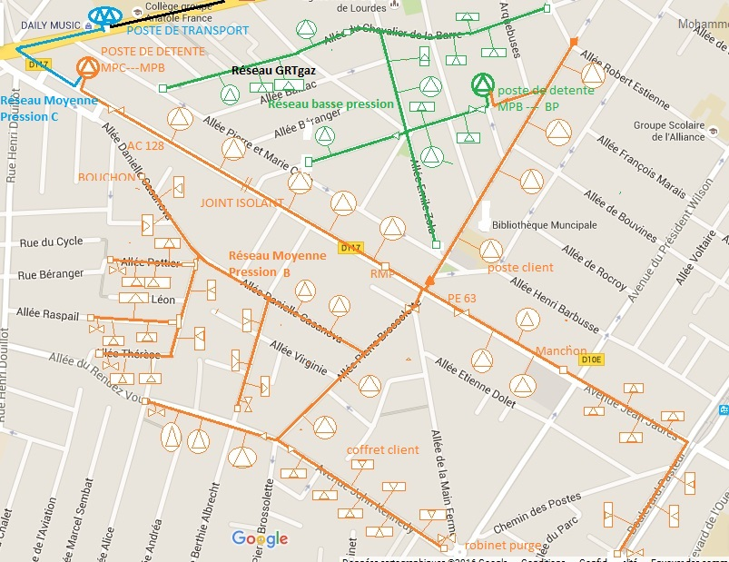
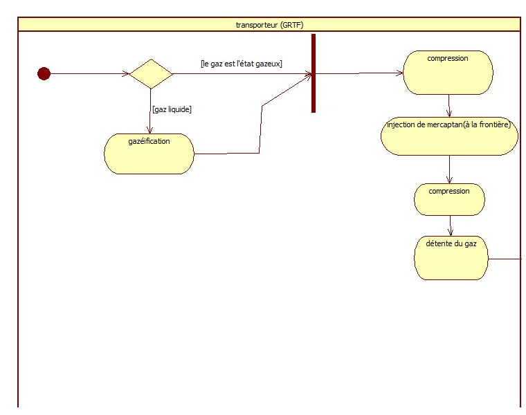
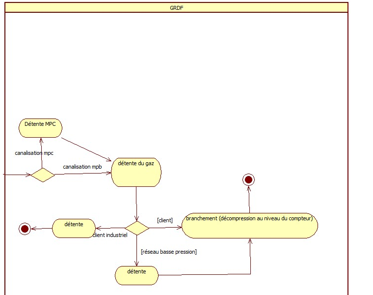
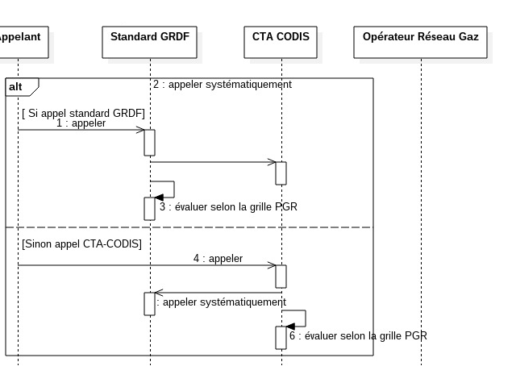
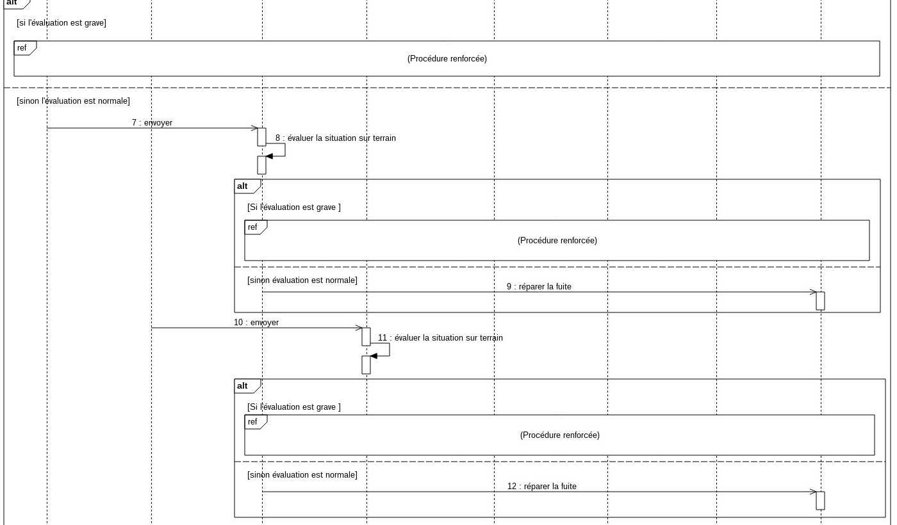
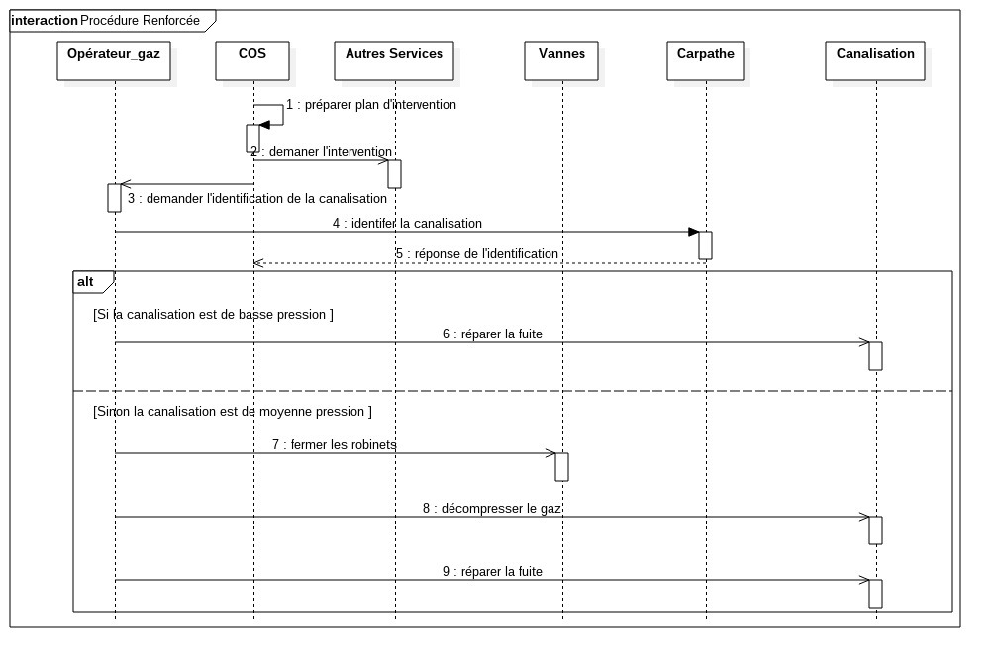
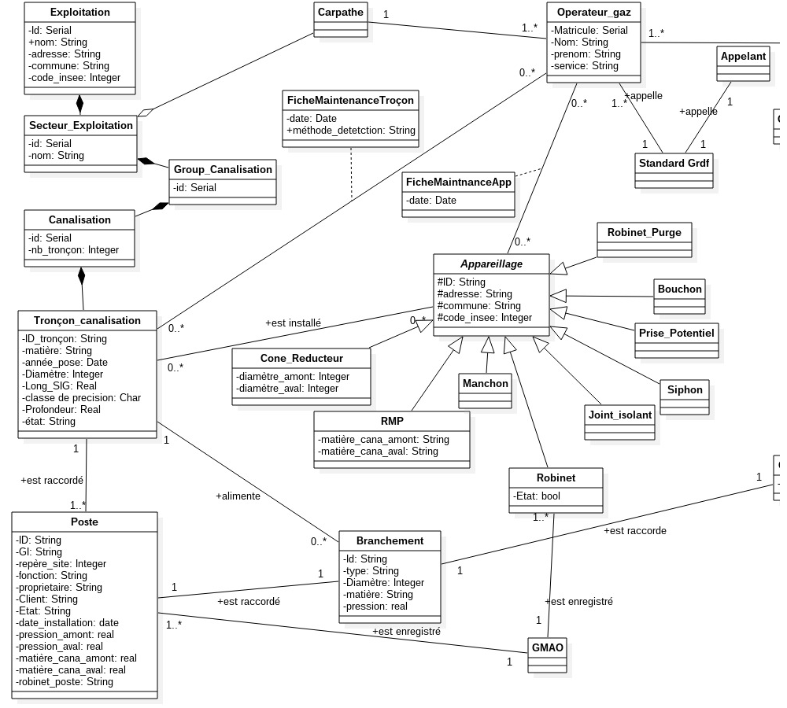
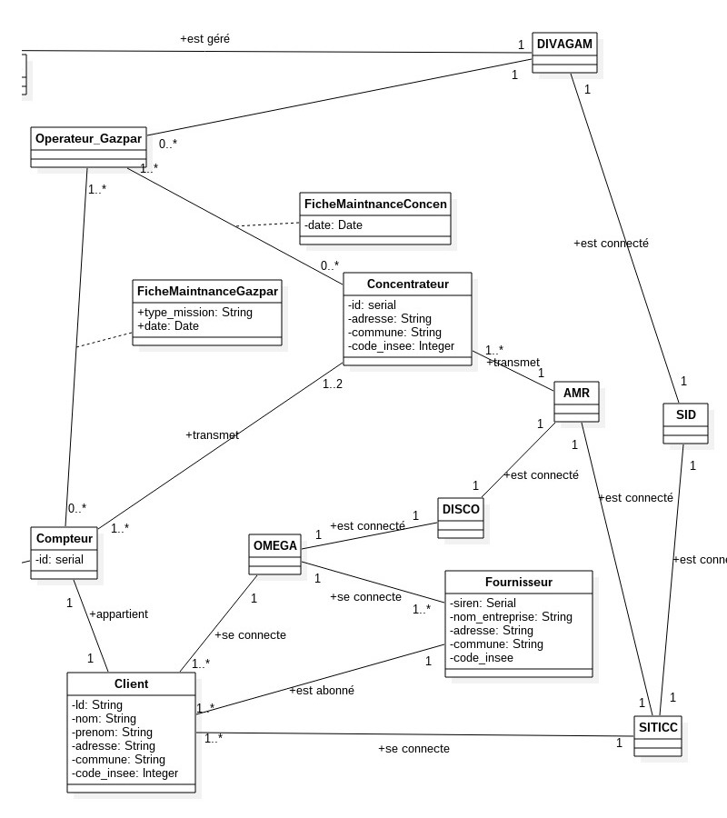

% Projet de Structuration
% Modélisation du réseau de Distrubition de gaz de Grdf
% Amiri Mohammed, Milville Romain et Pensier Philémon 

## Plan
<!--1- Introduction
2- Présentation
3- Intéraction avec le client
4- l'aspect securité
5- Conclusion -->

1- Introduction du sujet
2- Structure du réseau de distribution
3- Le transport du gaz
4- La sécurité du réseau
5- Collecte des données de consommation
6- Conclusion

<!-- ## 1- Introduction
Ce projet . -->

## 2- Présentation de Grdf
- une societé qui gère plus de 11 millions de clients.
- une société qui gere plus de 200 000 km de canalisation sur tous le teritoire français.
- environ 11000 employés.

<!-- présenter Grdf en citant ses principales missions 
<!-- Ajouter le use case à cet endroit: qu'est ce que l'on veut modéliser?-->

## 2- Présentation du réseau de distribution de Grdf(ajouter une légende)

<!--## 3- Le transport et la Sécurité
### 3-1 Le transport-->
## 3- Le transport du gaz
La partie transport

## 3- Le transport du gaz
La partie distribution

## 4- La sécurité du réseau
### 4-1 Un enjeux essentiel pour Grdf:
<!--donner des chiffres pour faire comprendre que la sécurité est un enjeu essentiel pour Grdf-->

<!--## 3- Le transport et la Sécurité
### 3-2 La sécurité-->
## 4- La sécurité du réseau
### 4-1 La procédure d'alerte

<!--## 3- Le transport et la Sécurité
### 3-2 La sécurité-->
## 4- La sécurité du réseau
### 4-1 La procédure d'alerte:

<!--## 3- Le transport et la Sécurité
### 3-2 La sécurité-->
## 4- La sécurité du réseau
### 4-1 La procédure d'alerte:

## 5- Collecte de données de consommation
Présentation du vieux système de comptage

## 5- Collecte de données de consommation
Présentation de Gazpar

## 5- Collecte de données de consommation
Présentation de Gazpar (S.I)

## 5- Collecte de données de consommation
diagramme1 sur Gapzar

## 5- Collecte de données de consommation
diagramme2 sur Gapzar

## 6- conclusion

## 6- conclusion

<!--
## 6- Conclusion
- Difficulté d'obtenir des informations auprès des agents de Grdf qu'on a rencontré.
- Difficulté de modéliser un système qui ne se répresente pas avec l'outis UML.
-->

#    Merci Pour votre attention
