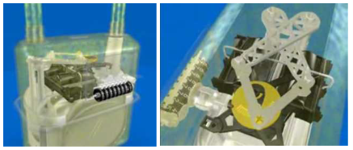

% Projet de Structuration
% Modélisation du réseau de Distribution de gaz de Grdf
% Amiri Mohammed, Milville Romain et Pensier Philémon 

## Plan
- 1- Introduction du sujet
- 2- Structure du réseau de distribution
- 3- Le transport du gaz
- 4- La sécurité du réseau
- 5- Collecte des données de consommation
- 6- Conclusion

<!-- ## 1- Introduction
Ce projet . -->

## 2- Introduction du sujet
- une societé qui gère plus de 11 millions de clients.
- une société qui gere plus de 200 000 km de canalisation sur tous le teritoire français.
- environ 11000 employés.

## 2- Présentation de notre projet

<!-- présenter Grdf en citant ses principales missions 
<!-- Ajouter le use case à cet endroit: qu'est ce que l'on veut modéliser?-->

## 2- Présentation du réseau de distribution de Grdf

<!--## 3- Le transport et la Sécurité
### 3-1 Le transport-->
## 3- Le transport du gaz : La partie transport

## 3- Le transport du gaz : La partie distribution

## 4- La sécurité du réseau
### 4-1 Un enjeux essentiel pour Grdf:
- 5000 accrochages/an
- risques de fuites et d'explosion

<!--## 3- Le transport et la Sécurité
### 3-2 La sécurité-->
## 4- La sécurité du réseau
### 4-2 La procédure d'alerte

<!--## 3- Le transport et la Sécurité
### 3-2 La sécurité-->
## 4- La sécurité du réseau
### 4-2 La procédure d'alerte:

<!--## 3- Le transport et la Sécurité
### 3-2 La sécurité-->
## 4- La sécurité du réseau
### 4-1 La procédure d'alerte:

## 5- Collecte de données de consommation
### 5-1 Le système jusqu'ici
<!--Présentation du vieux système de comptage:-->
- nécessite une intervention de relevé tous les six mois
- est basé sur un système mécanique simple.

## 5- Collecte de données de consommation
### 5-2 Le compteur communicant Gazpar
- 2009\: lancement du projet
- une solution simple, robuste et sécurisée.
 

## 5- Collecte de données de consommation
### 5-3 Le système d'information associé

## 5- Collecte de données de consommation

## 5- Collecte de données de consommation

## 6- Conclusion

## 6- Conclusion

## Merci de votre attention
