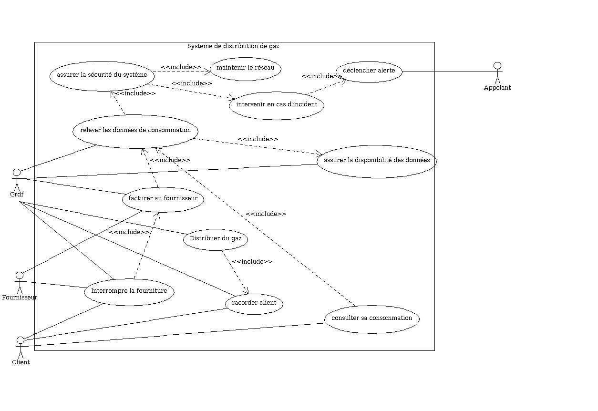
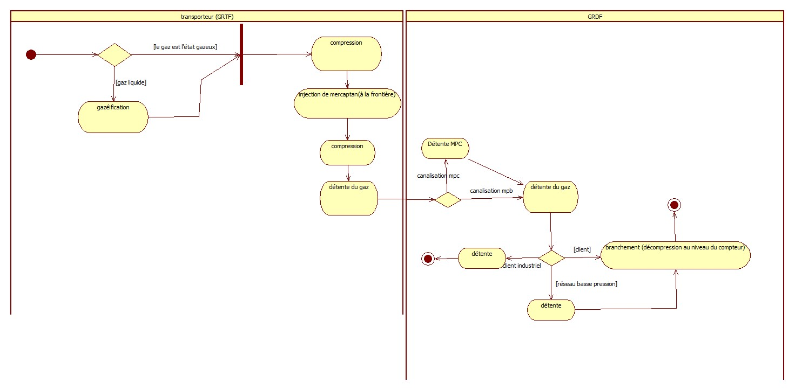
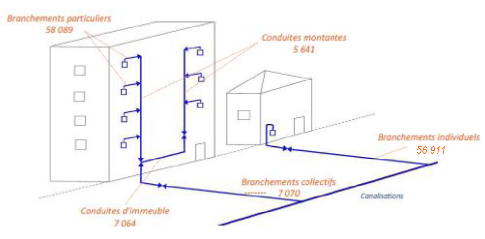
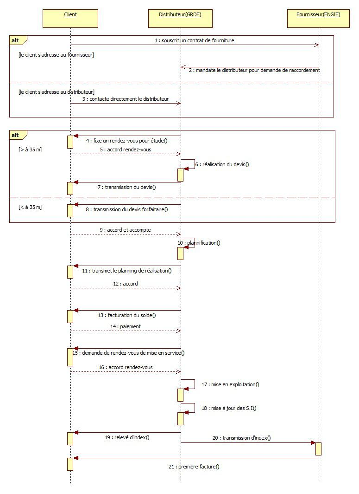
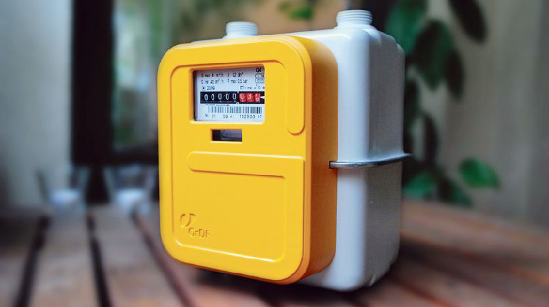
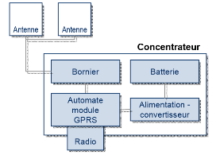
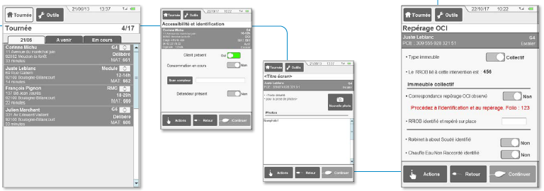
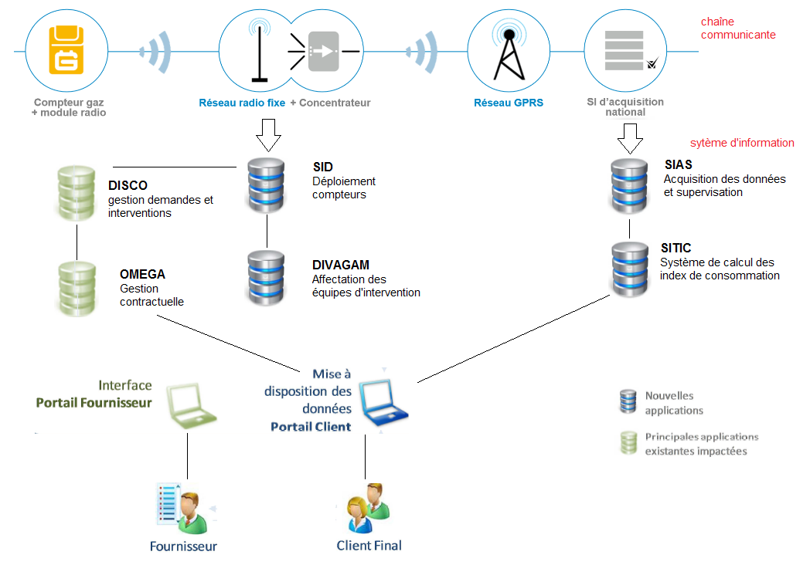
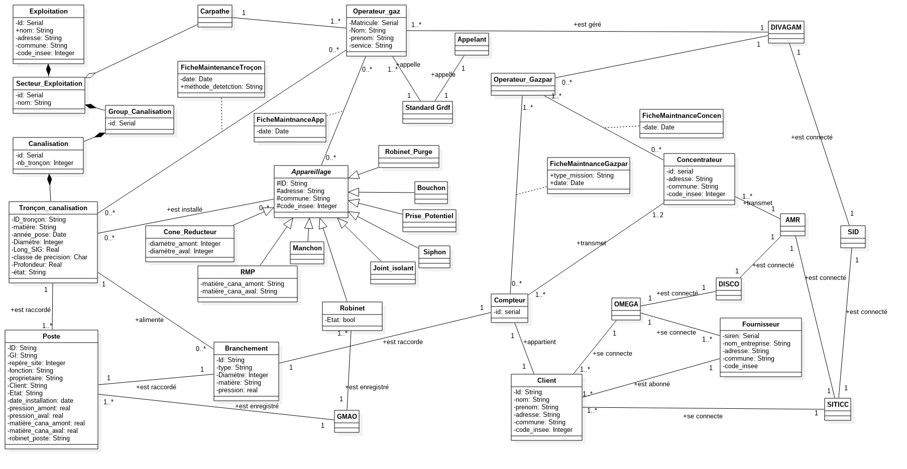

# Intruduction

Le présent rapport présente la structuration et la modélisation d'un système de distribution de gaz du point de vue de GrDF. L'UML (Unified Modeling Language) sera le principal outil utilisé.

Plusieurs points du système de distribution de gaz seront abordés :

* Le réseau en lui-même, comment est-il organisé, géré, maintenu... ?

* La mise en sécurité, comment gérer les alertes en cas de problème sur le réseau ?

* Enfin, le système de comptage avec notamment le nouveau système de compteur communiquant Gazpar.

# Présentation de GrDF

GrDF est une entreprise de distribution de gaz. Sa mission est d'acheminer le gaz afin que des personnes ou des entreprises puissent s'en servir comme énergie. Pour autant, GrDF ne doit pas être confondu avec un fournisseur de gaz qui est un entreprise qui vend le gaz à des clients. Il y a ainsi entre GrDF et les fournisseurs la même relation qu'il y avait entre la SNCF et RFF :

GrDF se sert du réseau pour acheminer le gaz qui appartient aux fournisseurs vers leurs client. Les fournisseurs payent GrDF en échange proportionnellement à l'énergie utilisé par les usagers.

Le prix payé par unité d'énergie consommé est fixé par la commission de régulation de l'énergie (CRE). Ce système a été mis en place afin de garantir une concurrence loyale entre les fournisseurs.

Pour autant, avant 2004, EDF-GDF assurait à la fois la distribution et le service clientèle. En 2004, EDF et GDF deviennent deux identités distinctes et à partir de 2007 GDF et GrDF sont séparés afin de donner libre concurrence aux différents fournisseurs. Aujourd'hui GrDF est une filiale d'ENGIE à 100 % et compte environ 11 000 employés. Le siège d'ENGIE se trouve à Courbevoie à La Défense.

Le réseau est composé d'un appareillage complexe, le schéma suivant montre un exemple de potrion de réseau où chaque type d'appareillage apparaît. Il montre ainsi comment cet appareillage s'organise.

Sur ce schéma, on observe d'abord plusieurs type de pression pour les canalisation (couleurs différentes). Ceci n'a pas d'impact sur chaque type d'appareillage.

Il existe plusieurs types de canalisations :

* Les canalisations en cuivre, Ce type de matériau a été très peu utilisé en raison de sa faible résistance au choc. Environ 20 km sont enregistrés dans le fichier patrimonial de GrDF. La pose a été réalisée majoritairement dans les années 1960. Les canalisations cuivre ont été utilisées pour réaliser des parties peu importantes des réseaux en moyenne pression B (MPB). L'arrêté du 13 juillet 2000 ne prévoit plus l'utilisation des canalisations cuivre.

* Les canalisations en acier. Elles sont utilisées depuis 1931 et ont surtout été utilisées dans les années 70/80. Ces canalisations sont munies de systèmes de protection cathodique pour éviter leur corrosion. On a deux types de protection, d'une par la protection passive correspondant à l'enrobage de la canalisation dans une substance isolante, d'autre part on a des protections actives qui correspondent à la mise en place d'anodes sacrificielles qui vont drainer les courants vagabonds et corriger le potentiel électrolytique.

* La canalisation en polyéthylène (PE). Elles se sont généralisées à partir des années 80. Ce sont en général des canalisations en moyenne pression B. Le succès de cette matière s'explique par la simplicité de mise en œuvre. En effet le PE permet l'utilisation de tubes de grandes longueurs et un raccordement des tubes par électrosoudage . Le PE est maintenant utilisé systématiquement pour l'installation de canalisations ayant une pression de moins de 10 bars.

* Les canalisations en fonte ductile. Elles sont utilisées depuis la mise en place du réseau de gaz. Elle sont utilisées pour le réseaux basse pression (BP). Ce sont les réseaux qui irriguent les centres villes, ils sont l'héritage des réseaux manufacturés. Un arrêté du 13 juillet 2000 portant sur la sécurité des réseaux de gaz ne prévoit plus la mise en place de telles canalisations et les réseaux BP sont progressivement remplacés par des réseaux moyenne pression B (de 4 bars)

Parmi l'appareillage du réseau on a :

* Les postes de détente. Ils permettent le changement de pression. Il y en a de plusieurs types, d'abord on a les postes de livraison qui font le lien entre le réseau de transport de GRT Gaz et GrDF. On a ensuite les postes de détente de concession qui permettent le changement de pression pour permettre l'utilisation du gaz.

* Les robinets et vannes. Ils permettent d'arrêter la fourniture en cas d'incident.

* Les manchons. Ils permettent le raccordement de plusieurs tubes de canalisation.

* Les compteurs. Ces derniers permettent de connaître le volume de gaz consommé par un poste client dans le but de pouvoir facturer au plus juste.

* Des cônes réducteur. Ils permettent la diminution du diamètre de la canalisation.

* Des bouchons. Placés en bout de canalisation, ils marquent la fin du réseau.

* Des prises de potentiel. Elles permettent la vérification du courant dans les tuyaux de composition métallique afin d'avoir une idée de leur corrosion.

* Des raccords métal-plastique (RMP). Ils permettent de faire le lien entre des canalisation en EP et des canalisation en métal.

* Des joints isolants.

* Des siphons.

* Des postes clients. Ce sont des utilisateurs industriels, la canalisation ne passe pas par un compteur classique.

La séquence de distribution du gaz sera présentée plus tard dans le rapport et reprendra la carte précédente.

## Utilisation du réseau

Le réseau, en plus des fournisseurs et de GrDF possèdent plusieurs acteurs. Le diagramme suivant présente les différentes utilisations possibles du réseau.

Les principaux cas d'utilisation du réseau etl es acteurs du projet sont présentées ci-dessous:

Nous venons donc de décrire l'utilisation que nos acteurs, dans le champ que l'on a délimité font du réseau de distribution.  Sans pour autant décrire chaque détail, nous allons expliquer comment le gaz est acheminé depuis l'endroit où il se situe naturellement jusqu'au consommateur.

## Transport du gaz

Le gaz distribué par GrDF est un gaz dit naturel : il provient des réserves souterraines ou sous-marines. Ces réserves de gaz sont le résultat de la décomposition d'êtres vivants au cours du temps. Cette décomposition passe par un phase de méthanisation. C'est à ce moment que le gaz naturel se forme, sa composition chimique est CH4 (méthane). Le gaz naturel est à opposer à ce que l'on appelait auparavant le gaz de ville qui était produit par extraction du méthane contenu dans le charbon. Cette activité est maintenant terminée. 

###Titre : Transporter le Gaz.

*Résumé* : Ce cas d'utilisation à GrDF de distribuer le gaz aux clients.

*Acteur* : GrDF.

*Description des scénario* :

*Préconditions* :

1. il y a du  gaz dans le réseau.

2. il y a des clients.

*scénario nominal* :

1. le gaz est dans le réseau.

2. si le gaz est liquide, il est gazéifié.

3. le gaz est comprimé

4. le mercaptan est injecté dans le gaz pour lui donner une odeur à la frontière.

5. le gaz est de nouveau comprimé afin  qu'il puisse avancer dans les canalisations.

6. soit il est détendu en  MPC.

7. soit il est détendu en  MPB.

8. s'il a été détendu en MPC, il est de nouveau détendu en MPB.

9. soit il est détendu pour alimenter un poster client (souvent industriel ou commercial).

10. soit il est détendu afin d'alimenter un consommateur classique.

11.soit il est détendu en basse pression pour alimenter un client classique (réseau en fonte ductile, remplacement à venir).

Suite au transport du gaz depuis les carrière naturel vient donc le consommateur, auquel GrDF ne facture rien directement mais avec qui il a tout de même certains liens.

# Relation avec le client

## Raccordement de nouveaux clients

Une des fonctionnalités du système de distribution de gaz est de pouvoir ajouter de nouveaux clients et donc de nouveaux bâtiments au réseau de gaz. Il faut pour cela réaliser éventuellement une extension de réseaux puis un branchement, qui correspond à la liaison entre les canalisations du réseau de gaz et le coffret individuel du particulier :

Représentation des branchements entre les canalisations et les particuliers

En dépit des évolutions législatives et réglementaires, suite à la mise en concurrence de l’énergie, Grdf reste responsable de la bonne réalisation de la procédure de raccordement. Deux cas sont possibles :

* La maison est située à moins de 35 mètres du réseau de distribution de gaz naturel et l’usager peut bénéficier d’une offre de raccordement forfaitaire.

* Dans le cas contraire, le raccordement fait l’objet d’un devis personnalisé.

Les travaux de raccordement nécessitent l’accord préalable des autorités administratives compétentes (voir publique). 

La procédure de branchement est la suivante :

### Scénario du branchement

*Cas d’utilisation* : 

raccorder un nouveau client au réseau.

Ce cas d’utilisation permet de raccorder un nouveau client au réseau de gaz.

*Acteurs* : 

Client, Distributeur, Fournisseur

*Préconditions* : 

Un nouveau client souhaite être raccordé au réseau de gaz.

*Scénario nominal*

1. le client contacte directement le distributeur pour une demande de raccordement.

2. La maison est à moins de 35 mètres et le distributeur transmet donc au client un devis forfaitaire, de façon synchrone.

3. Le client donne son accord au distributeur et verse un acompte.

4. Le distributeur réalise à son niveau la planification des travaux de raccordement.

5. Le distributeur transmet le planning de réalisation des travaux de raccordement au client, afin qu’il donne son accord.

6. Le client donne son accord au distributeur concernant le planning de réalisation.

7. Le distributeur facture le solde au client.

8. Le client effectue le paiement du solde au distributeur.

9. Le distributeur transmet une demande de rendez-vous au client pour réaliser la mise en service.

10. Le client transmet son accord au distributeur.

11. Le distributeur réalise la mise en service.

12. Le distributeur réalise la mise à jour des différents S.I concerné par le raccordement (CARPATHE, OMEGA,  DISCO).

13. Le distributeur procède au premier relevé d’index.

14. Le distributeur transmet alors l’index au fournisseur.

15. Le fournisseur envoie alors la première facture au client.

*Enchaînements alternatifs*

A1 \: le client s’adresse directement au fournisseur.
1. Le client souscrit un contrat de fourniture.
2. Le fournisseur mandate le distributeur pour une demande de raccordement.
A2 \: la maison est située à plus de 35 mètres du réseau de gaz.
4. Le distributeur fixe un rendez-vous au client pour réaliser l’étude appropriée.
5. Le client donne son accord à la demande de rendez-vous.
6. Le distributeur réalise le devis personnalisé.
7. Le distributeur transmet le devis au client.

*Post conditions* :

Le client peut désormais utiliser le gaz naturel, tant qu’il paye ses factures.

Comme les travaux de raccordement s’arrêtent au niveau du coffret de comptage du particulier, un installateur viendra par la suite sur place pour relier la maison et mettre en place les équipements intérieurs (pose de la canalisation reliant le coffret de comptage à la maison, mise en route des appareils de chauffage…). 

Bien sûr GrDF intervient pour relier le consommateur au réseau, mais GrDF intervient aussi pour couper l'accès du client au gaz.

## Interruption
### Titre : Interrompre la fourniture.
*Résumé* : Ce cas d'utilisation, permet à GrDF de couper le gaz pour les clients qui n'ont pas payés leurs consommations suite à la demande de leurs fournisseurs.

*Acteurs* : 

GrDF, fournisseur et client.

*Préconditions* :

1. Client n'a payé sa facture.
2. le fournisseur demande à GrDF de couper le gaz pour le client
3. Un agent est disponible pour se déplaçer.

*Scénario nominal* :

1. si le contrat du client n'est pas soumis à une obligation de maintient de fourniture, le fournisseur demande un déplacement pour couper le gaz à GrDF.

2. GrDF renvoie les informations pour la mission d'interruption.

3. Si client paye sa facture entre temps , le fournisseur demande d'annuler la mission d'interruption à GrDF.

4. Si la demande  ne dépasse pas le délai, GrDF annule la mission.

5. Le fournisseur informe le client pour qu'il ait la possibilité sa facture à l'opérateur GrDF.

6. GrDF envoie l'opérateur.

7. Si le fournisseur choisit l'option d'interruption ferme.

8. Si le client prouve le paiement de sa facture, l'opérateur GrDF informe le fournisseur.

9. Si le client ne prouve pas le paiement.

10. Si l'opérateur est confronté à un cas de force majeur, il informe le fournisseur.

11. sinon, l'opérateur ferme le robinet du compteur.

12. si le fournisseur choisit l'option d'interruption optionelle.

13. si le client est présent.

14. Si le client accepte de payer sa facture, l'opérateur informe le fournisseur.

15. sinon l'opérateur ferme le robinet de compteur.  

16. si le client refuse de payer sa facuture, l'opérateur ferme le robinet du compteur.

17. si le client est absent, l'opérateur ferme le robinet du compteur.

18. GrDF facture le déplacement au fournisseur.

Le graphique précédent présente la séquence amenant l'interruption de fourniture du gaz à un consommateur.

Tout d'abord il faut voir si il y a une obligation de maintien de fourniture. Cette obligation est décrite dans le décret n° 2008-780 du 13 août 2008 relatif à la procédure applicable en cas d'impayés des factures d'électricité, de gaz, de chaleur et d'eau.

Dans le cas où il n'y a pas obligation de maintien de fourniture, le fournisseur envoie les informations à propos de la mission d'interruption de fourniture du gaz.
Suite à cela GrDF envoie les informations concernant l'intervention.

Il est possible que le fournisseur demande l'annulation de l'intervention. Dans ce cas, soit cette demande d'annulation ne dépasse pas le délai d'attente et l'intervention est annulée, soit le fournisseur informe son client de l'intervention d'interruption de fourniture et lui laisse la possibilité  de payer l'agent.

L'opérateur GrDF est donc envoyé chez le client. Une nouvelle fois deux cas sont possibles :

* Soit la demande d'interruption est ferme.

* Soit c'est une demande d'interruption optionnelle.

Dans le cas d'une demande d'interruption ferme, soit le client prouve qu'il a bien payé sa facture à l'opérateur GrDF qui en informe alors le fournisseur, soit il ne peut pas prouver qu'il a payé. Si l'opérateur est confronté à un cas de force majeur et en informe alors le fournisseur, soit il ferme simplement le compteur du robinet de gaz.

Dans le cas d'une demande d'interruption optionnelle, soit le client est présent et a alors la possibilité de payer sa facture à l'opérateur qui peut prendre cette opportunité ce qui conduit l'opérateur à en informer le fournisseur. Il est aussi possible qu'il ne soit pas en mesure de payer, son robinet du compteur de gaz est alors fermé par l'opérateur.

En cas d'absence du client, son robinet est fermé par l'opérateur. Suite à cela, GrDF facture l'intervention au fournisseur.

# Transmission des données et sécurité

## Gazpar, le compteur communiquant

### L’état actuel du système de comptage

Actuellement, l’écrasante majorité des compteurs de gaz ne sont pas « intelligents » et nécessitent l’intervention d’un opérateur tous les 6 mois pour relever la consommation effective.  

l’intervention d’un opérateur tous les 6 mois pour relever la consommation effective.  
Depuis 50 ans, le système de comptage n’a donc pas tellement évolué. Il est en effet basé sur un dispositif à membranes : la membrane, mobile et étanche au gaz, de chaque compartiment est mise en mouvement par la différence de pression entre l’amont et l’aval du compteur. Les tiroirs de distribution admettent le gaz alternativement d’un côté de la membrane, puis de l’autre et d’un compartiment à l’autre. Les deux membranes sont reliées chacune à un embiellage qui transforme le mouvement alternatif des soufflets en un mouvement de rotation continu entraînant le totaliseur mécanique.

Ce dispositif est resté en l’état sur les compteurs les plus récents, qui possèdent seulement en plus une sortie exploitable pour les traitements électroniques. Toutefois, même si ce système de comptage reste fiable, il n’en demeure pas moins contraignant pour le distributeur qui est obligé de se déplacer pour relever la consommation tous les six mois, ainsi que pour le client qui doit être présent à ce moment. C’est pourquoi, d’autres systèmes de comptage sont actuellement à l’étude.

### Le système Gazpar

La phase de lancement du projet de compteur communicant, appelé GAZPAR, a vu le jour à la fin de l’année 2009, suite à la délibération de la Commission de Régulation de l’Energie (CRE) du 3 septembre 2009. Ce projet s'inscrit dans la politique de modernisation de GrDF débutée en 2004. Il est favorisé par le contexte institutionnel et réglementaire, en effet, une directive du conseil de l'Union Européenne de 2008 demande la mise à disposition des informations sur les consommations de gaz aux consommateurs. Il a pour objet de faire remonter des informations en direct concernant notamment l'index de consommation du foyer dans lequel il est installé, pour une facturation sur la consommation réelle.

Ce projet fait suite aux attentes des clients d’être facturés sur des index réel et non plus sur des estimations de consommations. D’autre part, l’accès à une donnée de consommation réelle et fréquente est un prérequis pour les autorités pour mieux sensibiliser à la maîtrise de la demande en énergie. Enfin, la modernisation des infrastructures améliorera la réactivité du fournisseur et du distributeur. En effet, une meilleure connaissance des quantités de gaz acheminées et consommées permettra l’optimisation de la gestion des réseaux de gaz.

Selon, les résultats de la consultation publique menée par la CRE en 2011, les fonctionnalités principales retenues sont les suivantes :

* Paramétrage du compteur en local
* Supervision de l’infrastructure de télé relève
* Prise en compte de demandes d’index faites par les fournisseurs
* Consommation réelle à périodicité mensuelle
* Modification ponctuelle du pas de mesure (pas horaire)

Le projet prévoit donc entre autre d’équiper ou de remplacer près de 11 millions de compteurs d’ici à 2022. GrDF estime que 10% des compteurs assez récents pourront être équipés d’un module radio pour la transmission des index de consommation et que les 90% restant seront remplacés par de nouveaux compteurs composés entre autre d’un module radio. Concrètement, la mise en œuvre du système de comptage évolué consiste à :

* Concevoir et construire une solution technique de télé relevé basée sur une solution de réseau radio fixe et des Systèmes d’Information (SI) permettant de collecter les données de consommation et d’effectuer le calcul d’énergie ;
* Déployer sur l’ensemble du territoire, environ 15 000 concentrateurs, d’après les études radio réalisées, maillons essentiels de la chaîne communicante, positionnés sur les points hauts.
*- Equiper ou remplacer près de 11 millions de compteurs d’ici à 2022. Environ 10% des compteurs les plus récents seront équipés de modules radio déportés (voir figure suivante), les 90% restants seront quant à eux remplacés par des « compteurs communicant gaz » équipés de modules radio intégrés.

Comme illustré sur la figure précédente, les compteurs les plus récents seront simplement équipés de module de transmission radio, qui sera composé principalement d’un quartz et d’une antenne et d’une pile, sensée durer 20 ans : 

(Image de détail du module électronique à brancher)

Le fonctionnement de la chaîne communicante est décrit sur le schéma suivant :

Deux fois par jour, et à raison de quelques secondes à chaque fois, le compteur Gazpar rentre en communication par ondes radio avec un concentrateur situé dans le voisinage sur un point haut afin de l'informer du dernier relevé de consommation. Chaque concentrateur collecte les informations de tous les compteurs Gazpar environnants et les retransmet à son tour, via le réseau GPRS (les concentrateurs possèdent de leur côté une carte SIM), à un centre national de supervision.

Pour d’évidentes raisons de sécurité relatives au caractère personnel des index de consommation et en accord avec la CNIL, les échanges de données sont sécurisés via un algorithme de chiffrement symétrique : AES 128. Le choix d’un algorithme symétrique se justifie par le fait que les communications doivent être rapides.

Lors de la communication du compteur vers le concentrateur, les données sont donc chiffrées puis transmises par ondes radio, à la fréquence de 169 MHz, en réseau local (LAN) aux deux concentrateurs les plus proches. La fréquence de 169 MHz correspond en France à la transmission de mesure, elle a été choisie par rapport la fréquence d’usage libre de 868 MHz, car à puissance égale une transmission à 169 MHz portera 5 fois plus loin qu’une émission à 868 MHz. Donc dans un souci de préserver la durée de vie de la pile et d’éviter d’avoir à installer d’éventuels répéteurs, ce qui rendrait le projet trop onéreux, la fréquence de 169 MHz apparaît optimale.

Une fois arrivées au concentrateur, les données sont ensuite retransmises au S.I d’acquisition national AMR (Automated Meter Reading). Lors de cette communication, les données (index et état des batteries) sont cette fois transmises via le réseau GRPS, en réseau étendu (WAN). La transmission GPRS a été cette fois choisie à cause de sa bande passante supérieure à celle du GSM. Le protocole de transmission du réseau GPRS est par ailleurs basé sur le protocole de communication TCP/IP (les concentrateurs possèdent en effet des adresses IP privatives).

En outre, la transmission des index de consommation a lieu 2 fois par jour et ne se déroule pas forcément tous les jours à heure fixe.

En outre, la transmission des index de consommation a lieu 2 fois par jour et ne se déroule pas forcément tous les jours à heure fixe.
Pour équiper ou remplacer les 11 millions de compteurs existants, GrDF a prévu un planning de cinq ans, de 2017 à 2022. Il est pour cela prévu d’installer de nouveaux systèmes d’information pour faciliter le déploiement (voir le paragraphe suivant), ainsi que de dédier des équipes à la pose de nouveau compteur. La pose du nouveau compteur fera l’objet d’un rendez-vous, fixé en accord avec le client un mois en amont. L’opérateur aura à sa disposition un outil de mobilité le renseignant sur les différentes opérations à réaliser sur le compteur, selon la figure suivante :

Comme illustré ci-dessus, l’outil donnera des informations au technicien sur le type d’intervention à réaliser pour chaque client (ex : organe de coupure individuel ou pas ?). Le technicien de pose s’appuiera sur celui-ci pour être guidé sur les gestes techniques à adopter lors de son intervention ; cet outil devrait lui permettre de réaliser environ 16 interventions chaque jour.

### Traitements des index de consommation

Pour chacun des 11 millions de compteur communicants qui seront prochainement installés sur  l’ensemble du territoire, GrDF va récupérer 2 relevés de consommation quotidiens. Ce qui représente un flux de données conséquent et nécessite donc la mise en place de nouveaux systèmes d’information ainsi que la mise à jour des systèmes d’information existants. Les différents systèmes d’information concernés ainsi que leurs interactions entre eux sont représentés sur la figure suivante : 

D’après le schéma précédent, les S.I mis en place avant l’apparition de Gazpar, OMEGA et DISCO ont dû être mis à jour. En effet, le rôle d’OMEGA est de mettre à disposition auprès des fournisseurs de gaz et des gestionnaires de réseau de transport, en temps réel, les informations relatives aux interventions et les mesures associées. Le système  donc dû s’adapter à une volumétrie importante puisqu’il gèrera désormais environ 11 millions de personnes et qu’il traitera 10 000 à 15 000 demandes par jour. 

*Cas d’utilisation* : 

collecter les données de consommation du client.

Ce cas d’utilisation permet de collecter les données de consommation du client.

*Acteurs* : 

Technicien (principal), compteur (secondaire), concentrateur (secondaire), AMR (secondaire), DISCO (secondaire), SITIC (secondaire), SID (secondaire), DIVAGAM (secondaire)

*Préconditions* :

on se situe à l’heure de relève automatique quotidienne de la consommation de gaz.

*Scénario nominal*

1. Le compteur chiffre les index de consommations.

2. Le compteur transmet les index chiffrés à deux concentrateurs habituels via des ondes radio à 169 MHz en réseau local (LAN).

3. Le concentrateur vérifie la véracité des informations.

4. Le concentrateur retransmet les informations au S.I d’acquisition national via le réseau GPRS en réseau étendu (WAN).

5. Le système d’acquisition déchiffre les informations.

6. Le système d’acquisition transmet les informations au système de calcul des index de consommation (SITIC).

7. SITIC calcule les index de consommation.

8. SITIC transmet les données à DISCO.

9. Mise à disposition des données à OMEGA en vue d’une facturation ultérieure.

10. Mise à disposition des données de consommation du client.

11. Mise à disposition des données de consommation au fournisseur.

Comme les travaux de raccordement s’arrêtent au niveau du coffret de comptage du particulier, un installateur viendra par la suite sur place pour relier la maison et mettre en place les équipements intérieurs (pose de la canalisation reliant le coffret de comptage à la maison, mise en route des appareils de chauffage…).

Comme illustré sur le diagramme de séquence représentant la collecte des données de consommation, ces informations doivent être mises à disposition du client quotidiennement et doivent également être mise à disposition du fournisseur.

Cette chaîne d'événements ne pourraient avoir lieux sans un réseau sûr, c'est pourquoi nous allons préciser comment le réseau est mis en sécurité. 

## Sécurité du réseau

Sur le réseau de GrDF, il y a certaines pièces mécaniques (robinet de gaz, pièce contenu dans les postes de détente...). Du fait de leur fonctionnement mécanique, ces pièce sont plus soumises à l'usure que les autres, cela implique une maintenance et une vigilance plus grande sur celles-ci. 
En plus des pièces soumises à un usure mécanique naturelle, il est possible qu'il y ait des fuite ailleurs sur le réseau. Afin de détecter des éventuelles fuites sur le réseau, GrDF à mis en place des véhicules munis de capteurs permettant de connaître la composition de l'air et notamment la teneur en méthane, possible indicateur de fuite de gaz. Les données récoltées par ces véhicules, croisées avec l'incidentologie et le données contenues dans le SIG de GrDF permettent de mettre en évidence les zones à moderniser sur le réseau.

Enfin, il est aussi possible que ce soit une tierce personne qui découvre une fuite. Dans ce dernier cas un standard est ouvert à GrDF afin de signaler l'incident. Le diagramme suivant décrit la séquence d'action lors d'un appel.

### Titre : Assurer la sécurité.
*Résumé* : 

Ce cas d'utilisation, permet à GrDF d'assuer la sécurité du réseau.

*Acteurs* : 

GrDF.

*Description des scénario* :

*Préconditions* :

1.le réseau est mis en place. 

2.déclenchement d'un alerte. 

3.disponibilité des opérateurs dédiés à la maintenance et sécurité. 

*Scénario nominal* :

1. L'appelant repère un incident  et décide d'appeler.

2. Si il appelle le Standard de GrDF, il y a un appel systématique au CTA-CDIS .

3. L'opérateur qui a répondu à l' appel fait évaluer la situation selon la grille PGR.
4. Sinon il appelle le standard CTA-CODIS, il y a aussi un appel systématique au standard de GrDF.
5. L'opérateur du standard du CTA-CODIS évalue la situation selon la grille PGR.
6. La situation est grave,  déclenchement de la procédure renforcée( voir scénario procédure renforcée).
7. Si la situation est normale, GrDF envoie l'opérateur.
8. L'opérateur fait l'évaluation sur terrain.
9. Si l'évaluation est grave, déclenchement de la procédure renforcée.
10. Si la situation est normale, il fait les réparations.
11. CTA-CODIS envoie le COS .
12. Le COS évalue la situation sur le terrrain.
13. Si l'évaluation est grave,  déclenchement de la procédure renforcée.
14. Sinon l'opérateur GrDF fait la réparation.

*Scénario nominal* (Procédure Renforcée).

1. COS prépare le plan d'intervention.

2. COS demande l'intervention des autres services (police, mairie, smur…).

3. COS demande à l'opérateur GrDF d'identifier la canalisation.

4. l'opérateur GrDF interroge  Carpathe pour identifier la canalisation.

5. Carpathe renvoie les données relatives à la canalisation.

6. Si la canalisation est de basse pression, l'opérateur GrDF effectue les réparations.

7. Si la canalisation est de moyenne pression, l'opérateur GrDF ferme les robinets.

8. l'opérateur GrDF  dépressurise la canalisation.

9.l'opérateur GrDF répare la canalisation.

Il est possible pour un appelant d'appeler le standard de GrDF ou le centre de traitement des alertes des pompiers. Si c'est le standard de GrDF qui est appelé, celui-ci relaie systématiquement l'appel aux pompiers et la situation est évaluée par téléphone.

Dans le cas où ce sont les pompiers qui sont appelés, l'appel est relayé à GrDF et la situation est évaluée selon les mêmes critères. 

Si la situation est jugée comme étant grave, il y a lancement de la procédure renforcée. Cette dernière est décrite dans le diagramme suivant.

Lorsque la procédure renforcée est lancée, les pompiers prépare le plan d'intervention puis demande l'intervention d'autres services (smur, police...). Ils demandent ensuite l'identification de la canalisation par un opérateur GrDF.  Cet opérateur interroge ensuite l'outil Carpathe afin d'identifier la canalisation puis donne la réponse aux pompiers.

Si la canalisation est en basse pression alors l'opérateur répare la canalisation.
Si elle est en moyenne pression, l'opérateur ferme les robinets de gaz alimentant la zone où a lieu la fuite, décompresse la canalisation puis la répare.

Dans le cas où l'évaluation est normale, la situation est de nouveau évaluée sur le terrain par l'opérateur GrDF. Si la situation est jugée grave, la procédure renforcée est lancée, dans le cas contraire la canalisation est réparée. De même les pompiers sont envoyés sur le terrain, et procèdent à une évaluation. Une nouvelle fois, si la situation est grave, la procédure renforcée est lancée, sinon la canalisation est réparée.

# Synthèse

Le diagramme du classe ci-dessus met en lien les différentes partie du rapport précédemment présentées. Y figure les principaux attributs de chaque classe.

Dans cette dernière partie on se focalisera sur la partie SIG de GrDF, le reste ayant été traité précédemment dans le rapport.

Du point de vue du SIG de GrDF, la classe la plus utilisée est le tronçon de canalisation. Celui-ci possède des attributs qui permette de le définir : sa matière, son année de pose... Ces Tronçons de canalisation peuvent être reliés à des postes. Ces postes peuvent être des postes clients (grand consommateur de gaz) ou des postes de détente. Si on a un client classque et pas un postre client, le tronçon de canalisation est en lien avec un branchement qui relie le tronçon au compteur. Le compteur est ensuite relié au système d'envoie de données comme présenté dans les parties précédentes. Ces Tronçons de canalisation sont aussi à relier à l'appareillage, en effet, c'est bien sur ces tronçons que seront reliés les différents manchons, robinets, etc...

Au dessus des tronçons de canalisation, on trouve la canalisation qui est une composition de tronçons.

De même une composition de canalisations forment un groupe de canalisation.

Une aggrégation de groupes de canalisations forment un secteur d'exploitation.

Enfin, plusieurs secteurs d'exploitation se trouvant sur une même zone géographique forment une exploitation.

# Bibliographie et sitographie

* Note d'information opérationnelle, Intervention pour fuite sur unréseau de gaz naturel, Ministère de l'Intérieur
 Procédure pour déplacement impayé, GrDF

* Projet compteurs communiquants gaz de GrDF, GrDF

* Projet compteurs communicants gaz, prestations de pose des nouveaux compteurs communiquants Gazpar, GrDF

* Prescriptions techniques applicables aux canalisations de transports de GRTgaz et aux installations de transport, de distribution et de stockage de gaz raccordés au réseau de GRTgaz.

* Etude comptage évolué gaz, Sopra Consulting
